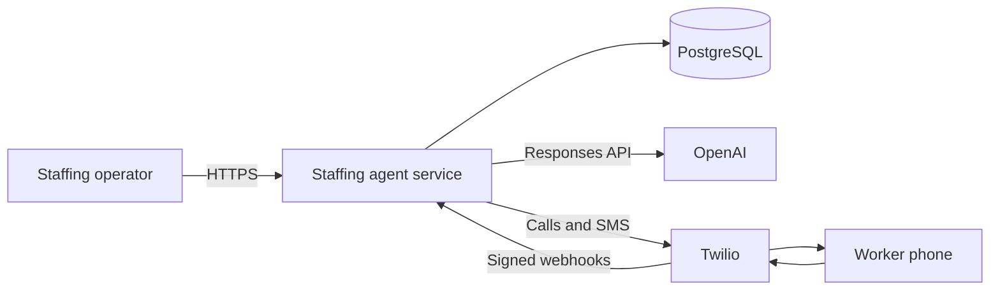

# Architecture and safety model

## System boundary

The application is one stateless Node.js service backed by PostgreSQL. It serves the operations dashboard, authenticated JSON API, Twilio webhooks, the OpenAI-assisted conversation loop, and a small database-backed job runner. A single deployment is intentional: it keeps the acceptance transaction and communications audit trail in one trust boundary while still allowing horizontal replicas.

## The model is not the authority

The language model receives a compact, purpose-specific prompt and a fixed set of strict function schemas. It may request an action, but it cannot write to the database. Application code always rechecks:

- organization and worker identity;
- active status and contact consent;
- shift state and remaining capacity;
- overlapping accepted assignments;
- tool arguments and current assignment state;
- idempotency for repeated Twilio webhooks or model calls.

The acceptance path uses a PostgreSQL transaction and row lock on the shift. Concurrent acceptances therefore cannot exceed headcount. A model or provider retry cannot bypass those constraints.

OpenAI requests use the Responses API, strict function schemas, `parallel_tool_calls: false`, and `store: false`. The default is the latency-oriented `gpt-5.6-luna` model, and the model remains configurable. Current OpenAI guidance recommends the Responses API for tool-calling workflows and strict schemas for reliable arguments: <https://developers.openai.com/api/docs/guides/function-calling>.

## Primary records

- `organizations` and `users`: tenant and operator access.
- `workers`: profile, roles, skills, certifications, availability, timezone, consent evidence, and contact suppression.
- `clients`, `locations`, and `shifts`: work demand and worksite details.
- `assignments`: candidate, offered, accepted, declined, cancelled, completed, and no-show states.
- `call_sessions` and `conversation_turns`: call lifecycle and minimal text transcript.
- `messages`: inbound/outbound SMS lifecycle and provider IDs.
- `jobs`: durable reminders, outbound calls, retry state, and idempotency keys.
- `audit_logs`: human, provider, worker, and system actions.

Every business record carries `organizationId`; authenticated reads and writes scope by that value.

## Voice lifecycle

1. An operator starts auto-fill, or explicitly calls one worker about one shift.
2. The server confirms voice consent, local contact window, worker eligibility, and a valid open shift.
3. A durable outbound-call job is claimed once and sent through Twilio.
4. Twilio requests signed TwiML. The agent discloses that it is automated and verifies it reached the intended worker before sharing shift details.
5. `<Gather>` collects speech or keypad input. Twilio posts the turn back to the service.
6. OpenAI selects at most one scheduling tool or returns a conversational clarification.
7. The server executes the requested scheduling action through the same validated scheduling service used by the dashboard.
8. Twilio status callbacks finalize the call. Provider callbacks and every business transition are audited.

Audio is not recorded by this application. Twilio supplies speech transcription for a turn; only the text needed for the scheduling audit is retained.

## Reminder lifecycle

Accepting a shift makes it eligible for the configured reminder offsets. The background scheduler materializes durable reminder jobs ahead of time; a worker then claims due jobs with PostgreSQL row locks, checks the assignment and SMS consent again, and uses one database idempotency key per assignment/offset. Cancellation, opt-out, or an inactive worker suppresses the message at send time. Inbound STOP/START events update the worker profile from Twilio's opt-out webhook metadata.

## Failure behavior

- Provider timeout: the durable job retries with bounded backoff; it never creates a second assignment.
- OpenAI timeout: the voice flow asks the worker to repeat or routes to a human callback; it does not guess.
- Duplicate webhook: provider IDs and idempotency keys collapse duplicates.
- Full or cancelled shift: an acceptance is rejected in the transaction and the worker receives a truthful response.
- Database unavailable: readiness fails and the process does not claim work.
- Invalid Twilio signature: the webhook is rejected before data access.
- Contact opt-out: future messages/calls are suppressed even if already queued.

## Scaling

The app is stateless outside PostgreSQL. Multiple replicas can serve HTTP traffic and run job polling because jobs are claimed with row-level locks. Begin with one replica for operational simplicity. At higher volume, split the same image into `web` and `worker` process types by toggling `SCHEDULER_ENABLED`, and add database connection pooling.
