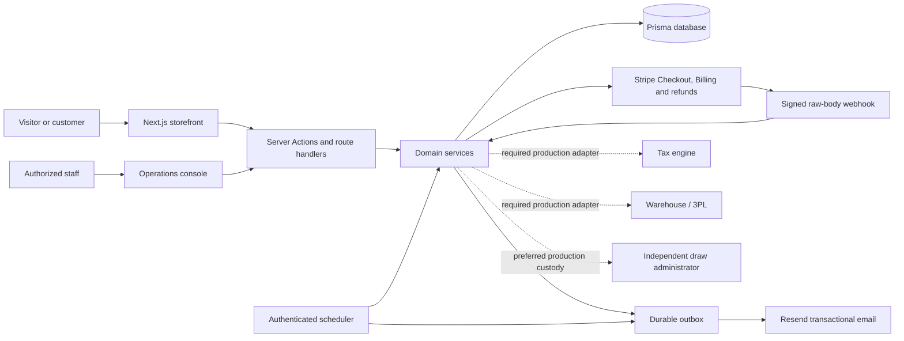
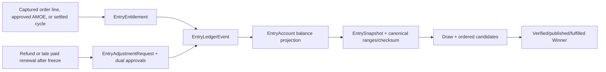
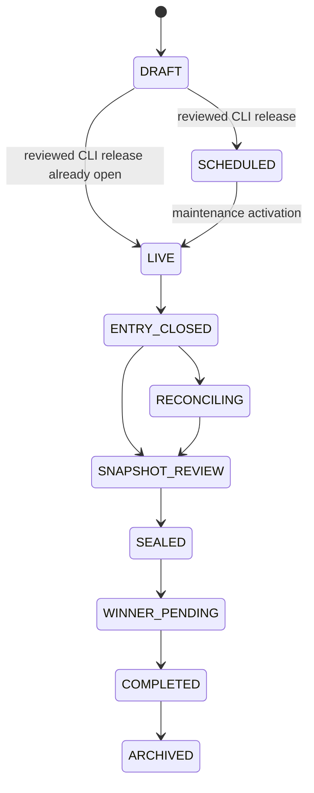

# Architecture

## Design principles

The template separates the brand/storefront from promotion accounting. A company can replace presentation and catalog data without changing the rules-to-ledger-to-draw chain.

1. The browser is never authoritative for price, inventory, entry rate, campaign time, eligibility, account balance or provider state.
2. Paid, no-purchase and membership grants reach one campaign/entrant account and one draw population.
3. Posted entries are append-only. Corrections are signed compensating events or controlled post-freeze adjustments.
4. External and material internal operations have an idempotency identity and reject conflicting reuse.
5. Every campaign, acceptance and entry calculation remains attributable to its exact configuration and Official Rules checksum.
6. Entry closure, provider reconciliation, snapshot review, sealing, selection, verification, publication and fulfillment are separate stages.
7. A rebrand cannot weaken an integrity boundary: UI quotes and links must be projections of the same server facts used at settlement.

## System context

Solid connections are implemented. Dotted connections are deliberate production gates.

## Repository boundaries

| Layer | Location | Responsibility |
| --- | --- | --- |
| App routes | `src/app` | Server-rendered pages, Server Actions, webhooks, public/health APIs |
| Components | `src/components` | Brandable UI, forms and participant/staff presentation |
| Theme | `src/theme` | Validated overlay schema, fallback theme and safe CSS-variable projection |
| Read models | `src/server/storefront.ts`, `src/server/*/dal.ts` | Tenant-scoped view models and authorization |
| Domain services | `src/server/commerce`, `entries`, `refunds`, `subscriptions`, `draws`, `winners`, `campaigns` | Authoritative parsing, calculation, transactions and state transitions |
| Provider edge | `src/server/providers`, `src/server/notifications` | Stripe/Resend contracts, signature verification, mapping, delivery claims and retries |
| Persistence | `prisma/schema.prisma` | Durable configuration, money, entry, audit and operator evidence |
| Demo invariants | `prisma/sql/sqlite-hardening.sql` | SQLite append-only and immutable-release/snapshot/source triggers |
| Release tools | `scripts`, `config/*.example.json` | Validated brand, theme, legal and campaign dry-run/publish workflows |
| Verification | `src/**/*.test.ts`, `tests/integration`, `tests/e2e` | Pure, service, disposable-database and browser/accessibility checks |

Sensitive provider/database modules are server-only. Client components hold convenience state, never the settlement authority.

## Tenancy

Durable business records carry `tenantId`; critical identities use tenant-scoped compound keys. Authentication resolves an exact active `primaryDomain`, then the configured `DEFAULT_TENANT_SLUG`. Sessions are accepted only when token digest, tenant, user state, expiry and role all match.

Public and authenticated reads resolve an exact active `primaryDomain`, with a configured default only for the canonical/local fallback. The recommended deployment shape remains **one public brand per deployment** until every provider account, staff role, export, backup and incident path has adversarial cross-tenant coverage. Never trust a form/query `tenantId`; Stripe metadata is accepted only after matching a server-created local record and fingerprint.

## Durable model

### Release configuration

- `Tenant` owns a brand deployment.
- `ThemeVersion` is a schema-versioned, checksummed appearance release; normal publishers create a new version instead of editing it.
- `LegalDocument` is an immutable, versioned policy/rules body with checksum and effective time.
- `Campaign` binds one exact `officialRulesDocumentId` and `officialRulesChecksum`, plus an immutable canonical release manifest/checksum containing reviewed configuration, evidence, active purchase catalog, and referenced membership plan/product transaction facts.
- `CampaignPrize`, `EntryRule`, `EntryMultiplierPeriod` and `MembershipEntryBand` describe prize and earning formulas.
- `CampaignApproval` and `FilingRequirement` preserve role-separated decisions, evidence and jurisdiction tasks.

### Identity, commerce and recurring billing

- `User` is an authenticated identity; `Entrant` is the promotion identity. A guest entrant may later be safely linked to one verified user.
- `CampaignEntrant` stores campaign eligibility/review state without mutating the tenant identity.
- `Product`, `ProductVariant`, `Collection` and `ProductCollection` form the catalog.
- `Order`, `OrderLine`, `Payment`, `Refund`, `RefundLineAllocation` and `InventoryAdjustment` preserve quoted/captured/refunded/stock facts.
- `SubscriptionPlan`, `Subscription` and `SubscriptionCycle` preserve enrollment, provider state, paid periods and cycle receipts.

### Entry and draw evidence

`EntryAccount` is unique per campaign/entrant. `EntryEntitlement` records origin, exact calculation, campaign/rules fingerprints, effective time and idempotency key. `EntryLedgerEvent` is the signed append-only delta. `EntryAccount.balance` is a transactionally maintained read projection and must reconcile to ledger sum.

`EntrySnapshotRow` maps every positive eligible balance into contiguous one-based ranges. `SnapshotApproval`, `Draw`, `DrawCandidate` and `Winner` preserve the custody and disposition chain. `EntryAdjustmentRequest` prevents a valid provider fact from being ignored merely because the population has frozen.

`RulesAcceptance`, `ConsentEvent`, `AuditEvent`, `WebhookEvent`, `OutboxEvent`, `SupportTicket`, `AccountChallenge` and `RateLimitBucket` provide supporting evidence and operations.

## Authoritative entry calculation

Purchase settlement calls the same deterministic resolver used to prepare storefront quotes:

1. Reload the active campaign, exact rules relation, products, variants, collections and active entry rules.
2. Match targeted rules (`ALL`, category, collection, product or variant) whose half-open date window contains the settlement time.
3. Resolve by explicit priority; ambiguity fails closed.
4. Calculate entries from qualifying whole currency units using the stored base rate, product multiplier, rule multiplier and scheduled campaign multiplier.
5. Apply the shared campaign/entrant cap in stable line order.
6. Store each source input, selected rule/version, rounding result and final grant on the order line/entitlement.

Tax and shipping do not earn entries. The browser's quote is informative; capture settlement repeats the calculation from authoritative facts.

AMOE selects the active `AMOE_FIXED` rule, validates structured location/age assertions and applies the same account/cap. Membership selects a complete, non-overlapping tenure band at paid invoice time and applies campaign eligibility, multiplier and cap. A valid paid invoice with no eligible campaign/band is still recorded as a zero-entry cycle.

## Provider flows

### Stripe one-time checkout

1. The server validates customer/cart input, reloads canonical money/rules/inventory and creates or reuses a prepared order plus reservation.
2. It creates Stripe Checkout with an `one-time-checkout-v1` metadata fingerprint and redirects only to an allowlisted Stripe-hosted URL.
3. The webhook verifies raw-body signature, pinned API version and test/live mode, then claims the event ID/payload hash.
4. Settlement matches provider identity, amount/currency and local fingerprint before atomically recording capture, final order lines, inventory, entries, acceptance, audit and outbox events.
5. Expiry/failure releases the reservation idempotently.

### Stripe recurring membership

Enrollment uses a server-resolved plan and `subscription-billing-v1` metadata, hosted Checkout and Billing Portal. Signed invoice/subscription webhooks bind the enrollment, record every paid cycle, advance periods and settle eligible entries exactly once. Provider timestamps, price, currency, interval and local subscription identity are revalidated.

### Refunds and frozen-population changes

A staff refund request computes explicit merchandise/shipping/tax allocation, persists a pending intent/fingerprint, then calls Stripe with `order-refund-v1` metadata. Webhook settlement must match that intent. Demo refunds use the same canonical allocation and settlement logic without an external call.

Before freeze, cumulative deterministic allocation reverses only entries earned by refunded merchandise. After freeze, monetary truth is still posted and a positive/negative adjustment case is created:

- before draw: distinct operations/compliance decisions void the old snapshot and rebuild from the corrected ledger;
- after draw: the original evidence is retained; an affected candidate/winner is dispositioned under the approved rules and fulfillment stays blocked while unresolved;
- after publication/fulfillment: the workflow fails closed rather than rewriting history.

## AMOE, account recovery and email

The no-purchase service enforces the independent cutoff, exact rules relation, structured eligibility, normalized phone/contact data, rate limits, daily normalized-email fingerprint and campaign cap. Demo mode may approve automatically; production-style mode queues a tenant-scoped role-separated review. Marketing consent is never a condition of entry.

Verification/recovery requests always return a generic response. The database stores only a single-use challenge digest and safe context; the outbox renderer reconstructs a short-lived signed token. Password reset consumes with compare-and-update and revokes all sessions. Verified users can claim uniquely matching guest history; ambiguous matches become a support review.

Domain transactions append outbox references. The maintenance worker leases a small batch, renders from current state, delivers via Resend using an idempotency key, retries transient failures and records terminal/stale outcomes.

## Snapshot, draw and winner lifecycle

`src/server/campaigns/lifecycle.ts` exposes a complete conceptual transition map for future drafting/review UI. The shipped campaign CLI performs review outside the application: it constructs a database `DRAFT` inside one transaction and, only after creating/checksumming all release evidence, commits directly to `SCHEDULED` or `LIVE`. `IN_REVIEW` and `APPROVED` are therefore not separate operator screens in this template.

Suspension/cancellation branches exist. Maintenance opens only approved, checksum-bound, two-person-approved scheduled campaigns and expires dead schedules; it closes the purchase path at `endsAt` without prematurely closing a later AMOE cutoff.

Snapshot construction uses the later purchase/AMOE cutoff, refuses unresolved provider/adjustment state, reconciles eligible accounts, stores canonical rows/checksum, then requires two distinct approvals to seal. The internal demo draw uses a cryptographically random seed and HMAC counter/rejection sampling, records commitments/checksum and produces ordered alternates. It demonstrates verifiability but is not independent custody.

Candidate contact has a recorded deadline. Verification cannot occur after it. Rejection/disqualification advances the ordered alternate rather than allowing staff choice. Publication requires verified state and consent; fulfillment requires no unresolved adjustment/disqualification issue and stores evidence.

## Database and concurrency invariants

The local workflow uses transactions, compound uniqueness, optimistic compare-and-update and SQLite triggers. The triggers reject mutation/deletion of ledger/audit rows, sealed snapshot rows, published legal releases and immutable adjustment/refund source facts, prevent late ledger inserts outside the controlled workflow, and freeze release-bound catalog/plan facts while a campaign is scheduled or live. After purchase close, historical verification uses the stored canonical catalog/plan evidence so the next campaign's catalog can be prepared without corrupting the prior draw package.

SQLite trigger coverage is a demo assurance layer, not a production migration strategy. Recreate and strengthen it in reviewed PostgreSQL migrations, including valid state constraints, tenant-consistent foreign keys, immutable fingerprints/sources, least-privilege roles and serializable/concurrency testing.

## Production extension points

Preserve provider payloads at the edge and map them to canonical facts. Add, without bypassing domain services:

- tax quote/commit/refund integration;
- fulfillment/tracking/returns consumer and reconciliation;
- Stripe dispute/chargeback adjustment mapping;
- bounce/complaint/suppression and marketing unsubscribe processing;
- distributed queue/scheduler with monitoring and dead letters;
- private object storage for winner/filing/draw evidence;
- staff MFA/SSO/step-up and finer capabilities;
- independent draw administrator/custody interface;
- PostgreSQL migrations, backup/PITR and restore verification.

The production readiness endpoint keeps tax/fulfillment and staff-MFA/independent-draw action-required until those controls are real.
